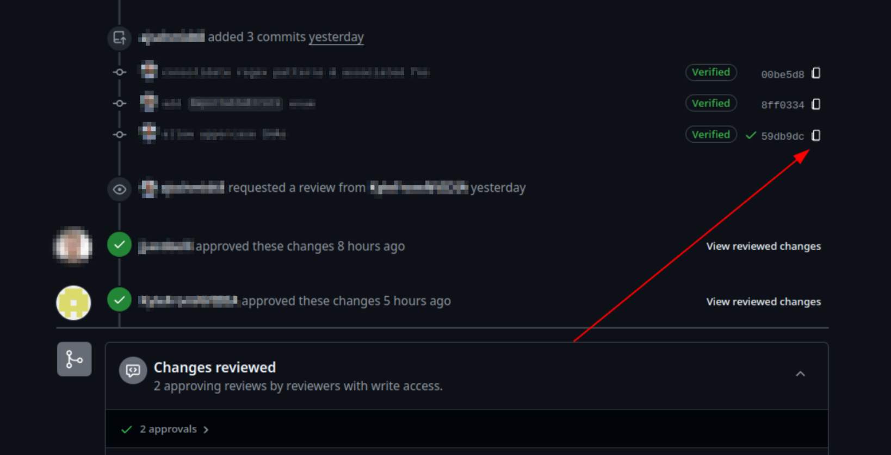

# add-copy-button-to-commits

This repository contains the source code for a [Tampermonkey](https://www.tampermonkey.net/) script that adds a "copy" button next to commit SHAs on GitHub pull request pages. The screenshot below shows an example of this functionality:

## Motivation

The motivation for this script is to make it easier for developers to copy commit SHAs from pull request pages on GitHub.

Without this script, copying SHAs from GitHub's pull request web pages can be a bit tricky. It requires clicking in the exact right location to highlight text. It also requires pasting the SHA as plain-text with `CTRL+SHIFT+V` vs. `CTRL+V` (otherwise it pastes the contents as a commit URL, which generally isn't the intended behavior). This script fixes both of those quirks and can be easily used in Chrome, Firefox, Safari, Edge, and Opera as described in the [Usage](#usage) section below.

## Usage

Follow the steps below to use the script:

- Install [Tampermonkey](https://www.tampermonkey.net/) in your browser using one of the browser store links below:
  - [Chrome](https://chromewebstore.google.com/detail/tampermonkey/dhdgffkkebhmkfjojejmpbldmpobfkfo)
  - [Firefox](https://addons.mozilla.org/en-US/firefox/addon/tampermonkey/)
  - [Safari](https://apps.apple.com/us/app/tampermonkey/id6738342400)
  - [Edge](https://microsoftedge.microsoft.com/addons/detail/tampermonkey/iikmkjmpaadaobahmlepeloendndfphd)
- Perform any necessary browser-specific post-installation steps:
  - **Chrome** - Enable developer mode for extensions - <https://www.tampermonkey.net/faq.php#Q209>
  - **Firefox** - N/A
  - **Others** - Untested
- Open up the raw file content of [add-button.user.js](./add-button.user.js) in your browser (using [these instructions from GitHub](https://docs.github.com/en/enterprise-cloud@latest/repositories/working-with-files/using-files/viewing-and-understanding-files#viewing-or-copying-the-raw-file-content))
- Tampermonkey will automatically recognize that you've opened up a `*.user.js` script and prompt you to install it
- Done! Navigate to a pull request page on GitHub now and you should see the "copy" button next to commit SHAs
  - If you don't see it right away, try closing and reopening your browser

## Managing Updates

Since this repository is public, Tampermonkey will periodically check it for updates automatically.
